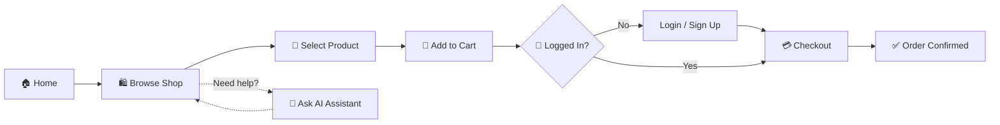

<div align="center">


<br/>

<a href="https://shahrishabh1513-jsk.github.io/HR-Atelier/"></a>
<a href="https://github.com/shahrishabh1513-jsk/HR-Atelier"></a>
<a href="https://github.com/shahrishabh1513-jsk/HR-Atelier/stargazers"></a>

<br/><br/>


<br/>


</div>

<br/>

<table align="center">
<tr>
<td align="center" width="20%"><sub>CATEGORY</sub><br><b>E-Commerce</b></td>
<td align="center" width="20%"><sub>PAGES</sub><br><b>8+</b></td>
<td align="center" width="20%"><sub>AI FEATURE</sub><br><b>Gemini Assistant</b></td>
<td align="center" width="20%"><sub>PRODUCTS</sub><br><b>8+ Categories</b></td>
<td align="center" width="20%"><sub>HOSTING</sub><br><b>GitHub Pages</b></td>
</tr>
</table>

<div align="center">

[](#-live-preview)
[](#-about-the-project)
[](#-key-features)
[](#-site-map)
[](#-user-workflow)
[](#️-tech-stack)
[](#-folder-structure)
[](#-getting-started)
[](#-connect)

</div>

<div align="center"></div>

## 🔍 Live Preview

<div align="center">

<b>Home</b>
<br/>
<a href="https://shahrishabh1513-jsk.github.io/HR-Atelier/" target="_blank">

</a>

<br/><br/>

<b>Shop</b>
<br/>
<a href="https://shahrishabh1513-jsk.github.io/HR-Atelier/products.html" target="_blank">

</a>

<br/><br/>

<b>Contact</b>
<br/>
<a href="https://shahrishabh1513-jsk.github.io/HR-Atelier/contact.html" target="_blank">

</a>

<br/><br/>

<a href="https://shahrishabh1513-jsk.github.io/HR-Atelier/" target="_blank">
  
</a>

</div>

> 💡 First-load screenshots can occasionally appear blank on `mshots` before the cache warms up — refresh the README page once if that happens; it self-corrects within a minute.

<div align="center"></div>

## 📖 About The Project

**HR Atelier** (live as *HR FashionStyle*) is a fully responsive **premium fashion e-commerce website** offering curated collections for women, men, and accessories. It covers the complete shopping journey — browsing trending products, managing a cart, checking out, and even getting help from a built-in **AI shopping assistant powered by Google Gemini**.

This project was built to practice real-world **front-end e-commerce architecture** with an added AI layer — multi-page navigation, dynamic product displays, cart/checkout flows, and conversational AI support — built with **HTML, CSS, JavaScript, and the Gemini API**.

> 💬 *"Elevate your style with premium fashion since 2026."*

<div align="center">

| | |
|---|---|
| 🛍️ **Type** | Front-end E-Commerce Website + AI Assistant |
| 🎯 **Built For** | Practicing e-commerce UX with AI-powered support |
| 🏷️ **Categories** | Women's Wear, Men's Wear, Accessories, Jewelry |
| 🤖 **Standout Feature** | In-store AI chat assistant (Gemini-powered) |
| 📦 **Core Flows** | Home → Shop → Cart → Login → Checkout |

</div>

<div align="center"></div>

## ✨ Key Features

<table>
<tr>
<td width="50%" valign="top">

### 🛒 Shopping Experience
- 🏬 **Shop** page with full product catalog
- 🆕 New Collection & **Summer Sale** promotional banners
- 👗 Trending products across multiple categories
- 💰 Live pricing with sale discounts

</td>
<td width="50%" valign="top">

### 🤖 AI Shopping Assistant
- 💬 In-app chatbot **powered by Google Gemini**
- ❓ Answers questions on returns, shipping & products
- ⚡ Suggests trending items on request
- 🎯 Always-available floating assistant widget

</td>
</tr>
<tr>
<td width="50%" valign="top">

### 👤 Account & Cart
- 🔐 **Sign In** page
- 🛒 **Cart** with live item count & subtotal
- 💳 Dedicated **Checkout** page
- 📦 My Orders & Wishlist entry points

</td>
<td width="50%" valign="top">

### 🎨 Design & UX
- 📱 Fully **responsive** across all devices
- 🖼️ Clean **grid-based product layouts**
- 🚚 Feature highlights: Free Shipping, 7-Day Returns, Secure Payment, 24/7 Support
- 📬 Newsletter subscription with first-order discount

</td>
</tr>
</table>

<div align="center"></div>

## 🗺️ Site Map

<div align="center">

| Page | Description |
|:---:|---|
| 🏠 **Home** | Hero banner, promotions, trending products & newsletter |
| 🛍️ **Shop** (`products.html`) | Full product catalog |
| ℹ️ **About** | Brand story & information |
| ✉️ **Contact** | Store address, phone & contact form |
| 🔐 **Login** | Customer sign-in |
| 🛒 **Cart** (`cartPage.html`) | Shopping cart with item management |
| 💳 **Checkout** | Order checkout flow |
| 🤖 **AI Assistant** | Floating Gemini-powered chat widget (site-wide) |

</div>

<div align="center"></div>

## 🧭 User Workflow



<div align="center"></div>

## 🛠️ Tech Stack

<div align="center">

| Category | Technology | Purpose |
|:---:|:---:|:---|
| **Markup** |  | Semantic page structure |
| **Styling** |  | Responsive grid & flex layouts |
| **Interactivity** |  | Cart logic, navigation & interactions |
| **AI Assistant** |  | Conversational shopping assistant |
| **Version Control** |   | Source control |
| **Deployment** |  | Live hosting |

</div>

<div align="center"></div>

## 📂 Folder Structure

<details>
<summary><b>Click to expand the folder structure 📁</b></summary>

```bash
HR-Atelier/
│
├── images/
│   ├── HRL1.png                    # Primary logo
│   ├── HRL2.png                      # Footer logo
│   └── products/                       # Product images
│
├── index.html                            # Home page
├── products.html                           # Shop / product catalog
├── about.html                                # About Us page
├── contact.html                                # Contact Us page
├── login.html                                    # Sign In page
├── cartPage.html                                   # Shopping cart
├── checkout.html                                     # Checkout page
│
├── css/
│   └── style.css                                        # All styles
│
├── js/
│   ├── cart.js                                              # Cart logic
│   ├── main.js                                                  # Shared interactions
│   └── ai-assistant.js                                              # Gemini AI chatbot logic
│
└── README.md                                                            # Project documentation
```

</details>

<div align="center"></div>

## 🚀 Getting Started

```bash
# 1️⃣ Clone the repository
git clone https://github.com/shahrishabh1513-jsk/HR-Atelier.git

# 2️⃣ Navigate into the project directory
cd HR-Atelier

# 3️⃣ Open index.html in your browser
#    (or use the Live Server extension in VS Code)
```

✅ Runs as a static **HTML/CSS/JS** site — no build tools required.

> ⚠️ **Note:** The AI Assistant feature requires a valid Gemini API key configured in `js/ai-assistant.js` (or your equivalent config file) to respond — without it, the rest of the store still works normally.

<div align="center"></div>

## 🧭 Roadmap

- [x] Multi-page storefront (Home, Shop, About, Contact)
- [x] Cart, Login & Checkout pages
- [x] Gemini-powered AI shopping assistant
- [ ] 🔧 Backend integration for real cart/checkout persistence
- [ ] 💳 Payment gateway integration
- [ ] 🔍 Product search & filtering
- [ ] 🌙 Dark mode

<div align="center"></div>

## 🤝 Connect

<div align="center">

**Rishabh Alpeshabhai Shah**

<a href="https://rishabh-shah-portfolio.netlify.app/"></a>
<a href="https://www.linkedin.com/in/rishabh-alpeshabhai-shah-91b9072a6/"></a>
<a href="mailto:shahrishu1515@gmail.com"></a>
<a href="https://github.com/shahrishabh1513-jsk"></a>

</div>

---

<div align="center">

### ⭐ If you like this project, give it a star — it helps a lot!


<br/>

**Made with 🛍️ & 🤖 by Rishabh Shah**


</div>
