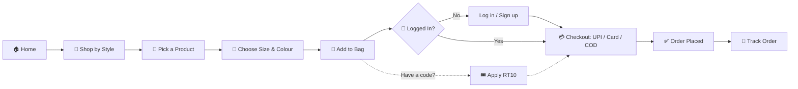

<table width="100%">
<tr>
<td width="15%" align="center">

</td>
<td width="70%" align="center">

</td>
<td width="15%" align="center">

</td>
</tr>
</table>

<div align="center">

<h3>Pick Your Size. Pick Your Colour. Wear It Tomorrow.</h3>


<br/>

<a href="https://shahrishabh1513-jsk.github.io/RT_Fashion-World/"></a>
<a href="https://github.com/shahrishabh1513-jsk/RT_Fashion-World"></a>
<a href="https://github.com/shahrishabh1513-jsk/RT_Fashion-World/stargazers"></a>

<br/>


<br/>


</div>

<br/>

<table align="center">
<tr>
<td align="center" width="20%"><sub>CATEGORY</sub><br><b>E-Commerce</b></td>
<td align="center" width="20%"><sub>DEPARTMENTS</sub><br><b>6</b></td>
<td align="center" width="20%"><sub>SALE</sub><br><b>Up to 40% Off</b></td>
<td align="center" width="20%"><sub>PAYMENTS</sub><br><b>UPI · Cards · COD</b></td>
<td align="center" width="20%"><sub>RETURNS</sub><br><b>15 Days</b></td>
</tr>
</table>

<div align="center">

[](#-live-preview)
[](#-about-the-project)
[](#-key-features)
[](#-site-map)
[](#-user-workflow)
[](#️-tech-stack)
[](#-folder-structure)
[](#-getting-started)
[](#-connect)

</div>

<div align="center"></div>

## 🔍 Live Preview

<div align="center">

<a href="https://shahrishabh1513-jsk.github.io/RT_Fashion-World/" target="_blank">

</a>

<sub>👆 Click to explore the live store</sub>

<br/>

<a href="https://shahrishabh1513-jsk.github.io/RT_Fashion-World/" target="_blank">
  
</a>

</div>


<div align="center"></div>

## 📖 About The Project

**RT_Fashion World** is a fully responsive **fashion e-commerce website** built around a fresh "pastel-season" collection for women and men, with bags, shoes, and jewelry to match. It covers the full shopping journey — browsing by style, filtering by category, saving favourites, managing a bag, signing in, checking out, and tracking an order.

The project was built to practice **real-world storefront UX**: category-driven product browsing, sale and promo-code handling, trust signals (shipping, returns, safe payments, stylist chat), and customer account flows — all in a clean pastel visual identity, using only **HTML, CSS, and JavaScript**.


<div align="center">

| | |
|---|---|
| 🛍️ **Type** | Front-end fashion e-commerce website |
| 🎯 **Built For** | Practicing storefront, bag & account flows |
| 🎨 **Collection Theme** | Pastel-season fashion — women, men, footwear, bags & jewelry |
| 🏷️ **Promo** | Mid-season sale (up to 40% off) + code `RT10` for 10% off the bag |
| 📦 **Core Flows** | Home → Shop → Bag → Login → Checkout → Track Order |

</div>

<div align="center"></div>

## ✨ Key Features

<table>
<tr>
<td width="50%" valign="top">

### 🛍️ Shopping Experience
- 🧭 **Shop by style** — six departments, one wardrobe
- 🔥 **Trending this week** swipeable carousel
- 🏷️ **Mid-season sale** page with up to 40% off
- 🎟️ Promo code **`RT10`** — 10% off your bag

</td>
<td width="50%" valign="top">

### 👤 Account & Orders
- 🔐 **Log in** and **Sign up** pages
- 👜 **Bag** with live item counter
- 💖 **Saved** items list
- 📦 **My orders** and 🚚 **Track order** pages

</td>
</tr>
<tr>
<td width="50%" valign="top">

### 🤝 Trust & Service
- 🚚 **Free shipping** on orders over ₹1,999
- ↩️ **15-day returns** with free size exchange
- 🔒 **Safe payments** — UPI, cards & COD
- 💬 **24/7 help** — chat with a stylist

</td>
<td width="50%" valign="top">

### 🎨 Content & Design
- ⭐ **Customer testimonials** section
- 📬 Newsletter — **₹200 off** your first order
- 🔍 Search overlay with `Esc` to close
- 📱 Fully **responsive**, pastel visual identity

</td>
</tr>
</table>

<div align="center"></div>

## 🗺️ Site Map

<div align="center">

| Page | Description |
|:---:|---|
| 🏠 **Home** (`index.html`) | Hero, shop-by-style, trending, sale banner, testimonials & newsletter |
| 🛍️ **Shop** (`products.html`) | Product catalog — filter by Women, Men, Footwear or Sale |
| 🔐 **Log in** (`login.html`) | Customer sign-in |
| 📝 **Sign up** (`signup.html`) | New account registration |
| 👜 **Bag** (`cartPage.html`) | Shopping bag with item management |
| 📦 **My orders** (`account.html`) | Account & order history |
| 🚚 **Track order** (`track.html`) | Order status tracking |
| ℹ️ **About us** (`about.html`) | Brand story |
| ✉️ **Contact** (`contact.html`) | Get in touch with the store |

</div>

<div align="center"></div>

## 🧭 User Workflow


```mermaid
flowchart LR
    A[🏠 Home] --> B[🧭 Shop by Style]
    B --> C[👗 Pick a Product]
    C --> D[📏 Choose Size & Colour]
    D --> E[👜 Add to Bag]
    E --> F{🔐 Logged In?}
    F -- No --> G[Log in / Sign up]
    G --> H[💳 Checkout: UPI / Card / COD]
    F -- Yes --> H
    H --> I[✅ Order Placed]
    I --> J[🚚 Track Order]

    E -.->|Have a code?| K[🎟️ Apply RT10]
    K -.-> H
```

<div align="center"></div>

## 🛠️ Tech Stack

<div align="center">

| Category | Technology | Purpose |
|:---:|:---:|:---|
| **Markup** |  | Semantic page structure |
| **Styling** |  | Pastel theme, responsive grid & flex layouts |
| **Interactivity** |  | Bag logic, filters, search & carousel |
| **Version Control** |   | Source control |
| **Deployment** |  | Live hosting |

</div>

<div align="center"></div>

## 📂 Folder Structure

<details>
<summary><b>Click to expand the folder structure 📁</b></summary>

```bash
RT_Fashion-World/
│
├── images/
│   ├── logo/                      
│   └── products/                    
│
├── index.html                       
├── products.html                        
├── login.html                              
├── signup.html                               
├── cartPage.html                               
├── account.html                                  
├── track.html                                      
├── about.html                                        
├── contact.html                                        
│
├── css/
│   └── style.css                                          
│
├── js/
│   ├── cart.js                                                
│   └── main.js                                                    
│
└── README.md                                                          
```

</details>

<div align="center"></div>

## 🚀 Getting Started

### Option 1 — Use the live version

No setup needed 👉 **[Open RT_Fashion World](https://shahrishabh1513-jsk.github.io/RT_Fashion-World/)**

### Option 2 — Run it locally

```bash
# 1️⃣ Clone the repository
git clone https://github.com/shahrishabh1513-jsk/RT_Fashion-World.git

# 2️⃣ Navigate into the project directory
cd RT_Fashion-World

# 3️⃣ Open index.html in your browser
#    (or use the Live Server extension in VS Code)
```

✅ No build tools, dependencies, or installations required — it's a pure **HTML/CSS/JS** project.

<div align="center"></div>

## 🧭 Roadmap

- [x] Multi-page storefront (Home, Shop, About, Contact)
- [x] Bag, Log in / Sign up, My orders & Track order pages
- [x] Sale banner with promo-code support
- [x] Testimonials & newsletter sections
- [ ] 🔧 Backend integration for real bag/checkout persistence
- [ ] 💳 Payment gateway integration
- [ ] 🔍 Advanced search & size/colour filters
- [ ] 🌙 Dark mode

<div align="center"></div>

## 🤝 Connect

<div align="center">

**Rishabh Alpeshabhai Shah**

<a href="https://rishabh-shah-portfolio.netlify.app/"></a>
<a href="https://www.linkedin.com/in/rishabh-alpeshabhai-shah-91b9072a6/"></a>
<a href="mailto:shahrishu1515@gmail.com"></a>
<a href="https://github.com/shahrishabh1513-jsk"></a>

</div>

---

<div align="center">

### ⭐ If you like this project, give it a star — it helps a lot!


<br/>

**Made with 🛍️ & 💜 by Rishabh Shah**


</div>
